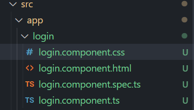

## Angular
* Angular front-end development framework.
* For developing Single Page Application.
* Developed by Google.
* MVC Framework.
* Open source.
* Use NPM and Command Line Interface(CLI).
* First released in 14th Sept 2016.

## Angular Vs Angular Js
* Angular Js is Oldest version not in use now.
* Latest version after version 2.
* Angular is re-written version, structure and upgraded framework.

## Setup and Installation
* Install Node and NPM.
* Install Angular CLI.
* Angular CLI command: npm install -g @angular/cli
* Use command: ng version - to check Angular version
* Install particular Angular version: npm install -g@angular/cli@10.0.0 (in CLI).
* Manage Node Js version command: nvm.

## Files and Folder Structure
1. Important file and folder for begineers:

    * package.json - Most important file, contains project details.
    * node_modules - Contains all libraries. Never mess with this file.
    * src folder - Most important folder, all development work is done inside this folder. app - is a component.
    * assests - Contains extra images, css etc.
    * environments - Essential for deployment.
    * index.html - First file to load.
    * main.js - Bootstrap(connects) html & angular.
    * style.css - Global css.

2. Important file and folder for advance:

    * package-lock.json - Carries details of all packages and the internal dependencies required by those packages.
    * angular.json - Application configuration file(like which file to load first, by default css file, etc).
    * tsconfig files - Configuration of typescript.
    * .browserslistrc - Details about which browsers application support.
    * karma.config.js - Test file configuration.
    * polyfill.ts - Used to add libraries to run application appropriately in browser.
    * .editorconfig - IDE configuration.

## Apply First Change in Angular App
* index.html - Starting project file.
* app.component.html - File inside <b>app</b> folder. Contain html code to display in web-page.<br>
    Eg:
    ```html
    <!-- Inside app.component.html file -->
    <h1>Hello {{title}}!</h1>
    <!--{{title}} - TypeScript code from app.component.ts file -->
    ```

## What is Interpolation?
### Interpolation
* Used to display dynamic data inside html page.<br>
    Eg:
    ```html
    <!-- Inside app.component.html file -->
    <h1>Hello {{title}}!</h1>
    <!--{{title}} - TypeScript code from app.component.ts file -->
    ```
* Dynamic data(inside app.component.ts file) as the data can be retrived from some logical calculation, API or some other component.<br>
    Eg:<br>
    Inside HTML
    ```html
    <h1>Hello {{title}} !</h1>
    <h2>{{getValue()}}</h2>
    ```
    Inside TypeScript
    ```typescript
    import { Component } from '@angular/core';

    @Component({
    selector: 'app-root',
    templateUrl: './app.component.html',
    styleUrls: ['./app.component.css']
    })
    export class AppComponent {
    title = 'blog';
    getValue() {
    return "Get function data."
    }
    }
    ```
    Web Page
    
    
* Can also perform arithmetic/logical operations using interpolation.<br>
    Eg:<br>
    Inside HTML
    ```html
        <h2>2+2</h2>
    ```
    Web Page
    
* Things we cannot perform using Interpolation:<br>
    1. Inside HTML<br>
        ```html
            <h1>{{title = "Web App"}}</h2>
            var++;
            <!-- Failed to Compile -->
        ```
        Also cannot increment, decrement, new keyword, assignment operator, typeOf etc.
* Can add class using HTML.
    ```html
        <h1 class={{title}}>Hello world!</h1>
    ```

## Angular CLI & Important Commands
* With the help of CLI we generate components, add config, build app, generate modules, services etc.
* CLI makes it easier for us to create files/folders required for our project.
* Use command <i>ng help</i> to list all commands.
* src/app(root folder) - Contains all components.
* Generate component:
```
// In cmd
> ng generate component component_name
// In short form
> ng g c component_name

```
* Inside a component:

    1. .css - For style.
    2. .html - structure of web page.
    3. spec.ts - For testing.
    4. .ts - TypeScript for logic.
In single line component, only one file is cretaed.

* Module Vs Component:<br>
    1. Module is more complex and adds bigger functionality.
    Eg: 
        ```
            > ng g m user-auth
            > ng g c user-auth/sign-in 
        ```
        Module can contain components.
    2. Component is simpler.
* To build project:
    ```
        > ng build
        // above command creates a dist\project_name
    ```
    We put the generated folder into the server to deploy our project.

## Component
* Component is a building block for creating some functionality/feature.
* Building block of website for a particular feature.
* Command:
    ```
    > ng g c component_name
    ```
* Inside app.module.ts the component gets automatically import.<br>
    Eg:
    ```typescript
        // Here we used > ng g c user-list to generate UserListComponent
        import { NgModule } from '@angular/core';
        import { BrowserModule } from '@angular/platform-browser';

        import { AppComponent } from './app.component';
        import { UserListComponent } from './user-list/user-list.component';

        @NgModule({
        declarations: [
            AppComponent,
            UserListComponent
        ],
        imports: [
            BrowserModule
        ],
        providers: [],
        bootstrap: [AppComponent]
        })
        export class AppModule { }
    ```
* To use the component:<br>
    Eg:<br>
    Inside .html:
    ```html
        <!-- Inside app.component.html, 
        add the component selector 
        inside component-name.component.ts
        ad html tag -->

        <!-- Inside app.component.html -->
        <app-user-list></app-user-list>

    ```
    Inside component's typescript file:
    ```typescript
        import { Component } from '@angular/core';

        @Component({
        selector: 'app-user-list', // Use this as html tag to use the component
        templateUrl: './user-list.component.html',
        styleUrls: ['./user-list.component.css']
        })

        export class UserListComponent {}
    ```
* We can use component selector inside same html file multiple times.
* We can also change the name of selector inside .ts file and use the changed name.
* Making separate component for each feature is a good practice.

## Component with Inline Style & Template
* Inline style command:
    ```
    >ng g c component_name --inline-style
    
    <!--
        * Above command will generate 
        component without .css file
        * Here, we write the css inline 
        inside .ts file
        * The css code goes inside 
    -->
    ```
    .ts file:
    ```typescript
        import { Component } from '@angular/core';

        @Component({
        selector: 'app-user-list',
        templateUrl: './user-list.component.html',
        styles: [ 
            `.custom{
            color: red;
            }`
        ]
        })
        export class UserListComponent {}
    ```
* Inline template command:
    ```
    >ng g c component_name --inline-template
    <!--
        * Above command will generate 
        component without .html file
        * Here, we write the html inline 
        inside .ts file
        * The html code goes inside 
    -->
    ```
    .ts file:
    ```typescript
        import { Component } from '@angular/core';

        @Component({
        selector: 'app-student-list',
        // html code goes here
        template: ` 
            <p>
            student-list works!
            </p>
        `,
        styleUrls: ['./student-list.component.css']
        })

        export class StudentListComponent {}
    ```
* Inline style and Inline template (together) command:
    ```
        > ng g c component-name --inline -style --inline -template
        <!-- 
            * Here only .ts file is generated.
            * Write html and css both inside .ts file
         -->
    ```
    .ts file:
    ```typescript
        import { Component } from '@angular/core';

        @Component({
        selector: 'app-country-list',
        template: `
            <p>
            country-list works!
            </p>
        `,
        styles: [`
            p{
            color: blue;
            }
        `
        ]
        })
        export class CountryListComponent {}
    ```

## Module
 
 * Create module command:
    ```html
    <!-- Generate module -->
    > ng g m module-name
    <!-- Generate component inside module -->
    > ng g m module-name/component-name
    ```

 * app.module.ts:
    ```typescript
        import { NgModule } from '@angular/core';
        import { BrowserModule } from '@angular/platform-browser';

        // To use module, here UserAuthModule is a custom module
        import { UserAuthModule } from './user-auth/user-auth.module'

        import { AppComponent } from './app.component';

        @NgModule({
        // store components/services here, separated by commas
        declarations: [
        AppComponent
        ],
        // store modules here, separated by commas
        imports: [
        BrowserModule
        ],
        providers: [],
        bootstrap: [AppComponent]
        })
        export class AppModule { }
    ```
* To use our module, we have to import it inside the app.module.ts file.<br>
    i. We need to export it in the module's .ts file.
    Eg:<br>
    ```typescript
        import { NgModule } from '@angular/core';
        import { CommonModule } from '@angular/common';
        import { LoginComponent } from './login/login.component';

        @NgModule({
        declarations: [
        LoginComponent
        ],
        imports: [
        CommonModule
        ],
        exports: [
        LoginComponent
        ]
        })
        export class UserAuthModule { }
    ```
## Make and call function on button click
* Create function inside app.component.ts file.<br>
    Eg:
    ```typescript
        import { Component } from '@angular/core';

        @Component({
        selector: 'app-root',
        templateUrl: './app.component.html',
        styleUrls: ['./app.component.css']
        })
        export class AppComponent {
        [x: string]: any;
        title = 'blog';

        getName() {
        alert('Function called!');
        }

        getNameParam(name:string, age:number) {
        alert("Hello " + name + "Age: " + age);
        }
        }
    ```
* To call the function in .html of the project.
    Eg:
    ```html
        <button (click)="getName()">Click Me</button>
        &nbsp;
        <button (click)="getNameParam('Smith',15)">Submit</button>
    ```
* Why data-type is now essential in latest version of Angular?<br>
 => Because, inside tsconfig.json file the strict: true. Earlier it used to be strict: false.

## Events
Event binding lets you listen for and respond to user actions such as keystrokes, mouse movements, clicks, and touches.<br>
Eg:<br>
Inside app.component.ts:
```typescript
    import { Component } from '@angular/core';

    @Component({
        selector: 'app-root',
        templateUrl: './app.component.html',
        styleUrls: ['./app.component.css']
    })
    export class AppComponent {
        [x: string]: any;
        title = 'blog';

        getData(val:string) {
            console.warn(val); // static
        }
    } 
```
Inside app.component.html:
```html
    <button (click)="getData('')">Call Function</button> <br>
    &nbsp;
    <!-- id_name can be anything -->
    <input type="text" #id_name (keyup)="getData(id_name.value)" placeholder="Event keyup">
    &nbsp;
    <input type="text" #id_1 (keydown)="getData(id_1.value)" placeholder="Event keydown">
    &nbsp;
    <!-- as soon as we shift focus from the box(i.e move cursor away) input gets recorded -->
    <input type="text" #id_2 (blur)="getData(id_2.value)" placeholder="Event blur">

    &nbsp;
    <input type="text" #id_3 (input)="getData(id_3.value)" placeholder="Event input">

    <br>
    <h1 type="text" #id_4 (mouseover)="getData('over')">Hello</h1>
```
Output:<br>
(keyup)

(keydown)

(blur)

(mouseover)


## Get Text Box Value And Print

Eg:<br>
* Step 1: Inside app.component.ts create function you want to perform, here we have getValue() function:
    ```typescript
        import { Component } from '@angular/core';
        @Component({
            selector: 'app-root',
            templateUrl: './app.component.html',
            styleUrls: ['./app.component.css']
        })
        export class AppComponent {
            [x: string]: any;
            title = 'blog';

            displayVal:string ='';

            getValue(val: any) {
                console.warn(val);
                this.displayVal = val;
            }
        }
    ```
* Step 2: Inside app.component.html use html tag id to display value entered inside input tag:
    ```html
    <input type="text" #id_0 placeholder="Enter Name" name="name">
    <br>

    <!-- to get value typed in input box -->
    <button (click)="getValue(id_0.value)">Click</button>

    <!-- to get name of input box -->
    <button (click)="getValue(id_0.name)">Click</button>

    <p>{{displayVal}}</p>
    ```
* Output:


## Make Counter (assignment)
* Make a counter front-end app to increment/decrement value:<br>
    1. Inside app.component.ts:
        ```typescript
        import { Component } from '@angular/core';

        @Component({
        selector: 'app-root',
        templateUrl: './app.component.html',
        styleUrls: ['./app.component.css']
        })
        export class AppComponent {
        [x: string]: any;
        title = 'blog';

        count = 0;

        counter(operator:string) {
            operator === '++' ? this.count++:this.count--;
        }
        }
        ```
    2. Inside app.component.html:
        ```html
        <button (click)="counter('--')">--</button>
        &nbsp;
        <button (click)="counter('++')">++</button>
        <br>
        <p>Count value: {{count}}</p>
        ```
    3. Output:
        

## Basic Rule of Style
* <b>Component Style</b>: To change css of particular component then change in its specific .css file.
* <b>Global Style</b>:To change css of component thoughout the project(say h1-tag across the project), then make changes in the style.css file(global css).
* <b>Internal Style:</b> Write css in html file within < style> css code goes here< /style> tags.
* Internal style > Component Style > Global Style <= in terms of priority.

## Property Binding
Property binding in Angular helps you set values for properties of HTML elements or directives. Use property binding to do things such as toggle button features, set paths programmatically, and share values between components.

* Difference between Property Binding and Interpolation:<br>
Eg:
    1. Syntax:
    ```html
    <!-- Interpolation -->
    <input type="text" name="user-name" value="{{name}}">
    <br>
    <!-- Property Binding -->
    <input type="text" name="password" [value]="name">
    ```
    2. Differences: Cannot treat boolean values.<br>
        Html:
        ```html
        <!-- Interpolation -->
        <input type="text" name="user-name" value="{{name}}" disabled="{{disable}}">
        <br>
        <!-- Property Binding -->
        <input type="text" name="password" [value]="name" [disabled]="disable">

        ```
        TypeScript:
        ```typescript
        import { Component } from '@angular/core';

        @Component({
            selector: 'app-root',
            templateUrl: './app.component.html',
            styleUrls: ['./app.component.css']
        })
        export class AppComponent {
            [x: string]: any;
            title = 'blog';
            name = "Ram";
            disable = false;
        }
        ```
        The web-page does not respond accordingly. input-tag remain disabled though value set is false, if we use interpolation.

        Output:
        
    3. Exercise: Check using buttons.<br>
        Eg:<br>
        * app.component.html:
            ```html
            <!-- interpolation -->
            <button  disabled="false" (click)="display()">Not Works!</button>
            &nbsp;
            <!-- process binding -->
            <button [disabled]="false" (click)="display()">Works!</button>

            <p>Display: {{displayVal}}</p>
            ```
        * app.component.ts:
            ```typescript
            import { Component } from '@angular/core';

            @Component({
                selector: 'app-root',
                templateUrl: './app.component.html',
                styleUrls: ['./app.component.css']
            })
            export class AppComponent {
                [x: string]: any;
                title = 'blog';
                name = "Ram";
                disable = false;

                displayVal = '';
                display() {
                    this.displayVal = 'Namaste!!!';
                }
            }
            ```
        * Output: Despite disabled="false", input-tag that uses interpolation does not work properly.
        

## If-Else Condition
* Inside app.component.html:
    ```html
    <h1 *ngIf="show; then ifBlock else elseBlock"></h1>
    <!-- we can also compare strings to check -->
    <h1 *ngIf="show == 'yes'; then ifBlock else elseBlock"></h1>

    <ng-template #ifBlock>
        <h1>If Condition</h1>
    </ng-template>

    <ng-template #elseBlock>
        <h1>Else Condition</h1>
    </ng-template>
    ```
* Inside app.component.ts:
    ```typescript
    import { Component } from '@angular/core';

    @Component({
    selector: 'app-root',
    templateUrl: './app.component.html',
    styleUrls: ['./app.component.css']
    })
    export class AppComponent {
    [x: string]: any;
    title = 'blog';
    show = true;
    show_1 = 'yes'; // we can also compare strings
    }
    ```
* Output: As show is set true, ifBlock gets executed.
* *ngIf vs [ngIf]:
    

## Multiple condition or else if
* In angular we only have *ngIF / [ngIf], we do not have else-if/ else.
* Eg:<br>
    * Inside app.component.html:
        ```html
        <!-- below code prints color based on input -->
        <input #input_id type="text" placeholder="Enter color">
        &nbsp; &nbsp;
        <button (click)="getColor(input_id.value)">Submit</button>
        <br>

        <!-- multiple else conditions -->
        <ng-template [ngIf]="color === 'red'">
            <h1 style="color: red;">Red</h1>
        </ng-template>
        <ng-template [ngIf]="color === 'blue'">
            <h1 style="color: blue;">Blue</h1>
        </ng-template>
        <ng-template [ngIf]="color === 'green'">
            <h1 style="color: green;">Green</h1>
        </ng-template>
        ```
    * Inside app.component.ts
        ```typescript
        import { Component } from '@angular/core';

        @Component({
            selector: 'app-root',
            templateUrl: './app.component.html',
            styleUrls: ['./app.component.css']
        })
        export class AppComponent {
            [x: string]: any;
            title = 'blog';
            color = '';

            getColor(colorVal: string) {
                if(colorVal === 'red')
                this.color = colorVal;
                else if(colorVal === 'blue') {
                this.color = colorVal;
                }
                else 
                this.color = colorVal;
            }
        }
        ```
    * Output:
        

## Switch Case
* If there are many conditions then we prefer to use switch case over if condition.
* Eg:<br>
    * app.component.html
        ```html
        <div [ngSwitch]="color">
            <h1 *ngSwitchCase="'red'" style="color: red;">Red</h1>
            <h1 *ngSwitchCase="'blue'" style="color: blue;">Blue</h1>
            <h1 *ngSwitchCase="'green'" style="color: green;">Green</h1>
            <h1 *ngSwitchCase="'yellow'" style="color: green;">Yellow</h1>
            <h1 *ngSwitchCase="'brown'" style="color: green;">Brown</h1>
            <!-- if no case matches -->
            <h1 *ngSwitchDefault>Unknown Color</h1>
        </div>
        ```
    * app.component.ts
        ```typescript
        import { Component } from '@angular/core';

        @Component({
            selector: 'app-root',
            templateUrl: './app.component.html',
            styleUrls: ['./app.component.css']
        })
        export class AppComponent {
        [x: string]: any;
        title = 'blog';
        color = 'red'; // changeable
        }
        ```
## For Loop
* Eg:
    * Inside app.component.html
        ```html
        <h2>Display users:</h2>
        <p *ngFor="let item of users">{{users.indexOf(item) + 1}}. {{item}}</p>
        <br>
        <h2>Player details: </h2>
        <p *ngFor="let obj of userDetails">{{userDetails.indexOf(obj) + 1}}. {{obj.name}} SR: {{obj.sr}}</p>
        ```
    * Inside app.component.ts
        ```typescript
        import { Component } from '@angular/core';

        @Component({
            selector: 'app-root',
            templateUrl: './app.component.html',
            styleUrls: ['./app.component.css']
        })
        export class AppComponent {
            [x: string]: any;
            title = 'blog';
            // array
            users = ['Virat', 'Dhoni', 'Gill', 'Rohit', 'Surya'];

            // array of objects
            userDetails=[
                {name: 'Virat', sr: 135},
                {name: 'Dhoni', sr: 147},
                {name: 'Gill', sr: 143},
                {name: 'Rohit', sr: 153},
                {name: 'Surya', sr: 168}
            ]
        }
        ```
## Nested Loops
Eg:
* .html code:
```html
<ul *ngFor="let user of userDetails">
    <li>{{user.name}}</li>
    <li> Teams
        <ul *ngFor="let team of user.teams">{{team}}</ul>
    </li>
</ul>
```
* typescript code:
```typescript
import { Component } from '@angular/core';

@Component({
  selector: 'app-root',
  templateUrl: './app.component.html',
  styleUrls: ['./app.component.css']
})
export class AppComponent {
[x: string]: any;
  title = 'blog';

  // nested array
  userDetails=[
    {name: 'Virat', sr: 135, jersy: 18, teams: ['rcb','rr','dd']},
    {name: 'Dhoni', sr: 147, jersy: 7, teams: ['csk','rps']},
    {name: 'Gill', sr: 143, jersy: 77, teams: ['kkr','gt']},
    {name: 'Rohit', sr: 153, jersy: 45, teams:['rr','mi']},
    {name: 'Surya', sr: 168, jersy: 30, teams: ['kkr','mi']}
  ]
}
```
## Style Binding
* Use class and style bindings to add and remove CSS class names from an element's ```class``` attribute and to set styles dynamically. <br>
    Eg:
    * html file code:
    ```html
    <!-- gets color from .ts file -->
    <h1 [style.color]="color">Hello</h1>
    ```
    * typescript code:
    ```typescript
    import { Component } from '@angular/core';

    @Component({
    selector: 'app-root',
    templateUrl: './app.component.html',
    styleUrls: ['./app.component.css']
    })
    export class AppComponent {
    [x: string]: any;
    title = 'blog';
    // set any color name 
    color = 'red';
    }
    ```

    Eg: Apply on button click.
    * html file code:
    ```html
    <h1 [style.color]="color" [style.backgroundColor]="bgColor">Hello</h1>

    <button (click)="updateColor()">Update Color</button>
    ```
    * typescript file code:
    ```typescript
    import { Component } from '@angular/core';

    @Component({
    selector: 'app-root',
    templateUrl: './app.component.html',
    styleUrls: ['./app.component.css']
    })
    export class AppComponent {
    [x: string]: any;
    title = 'blog';
    color = 'red';
    bgColor = 'yellow'

    updateColor() {
        this.color = 'purple';
        this.bgColor = 'green';
    }
    }
    ```
## Header
* Step 1: Create a component(say: nav-bar[header])
    ``` 
    > ng g c header
    ```
* Step 2: Add selector of above component in app.component.html
    ```
    <app-header></app-header>
    ```
* Step 3: In header component, inside .html file
    ```html
    <nav>
        
        <ul>
            <li><a href="">Login</a></li>
            <li><a href="">Sign Up</a></li>
            <li><a href="">Home</a></li>
            <li><a href="">About</a></li>
        </ul>
    </nav>
    ```
* Step 4: In header component, inside .css file
    ```css
    nav img{
    width: 70px;
    }
    nav {
        background-color: blue;
        padding: 10px;
    }
    ul {
        float: right;
        list-style-type: none;

    }
    ul li {
        display: inline-block;
        padding: 10px;
    }
    li a {
        color: aliceblue;
        text-decoration: none;
        cursor: pointer;
        padding: 10px;
    }
    ```
* Step 5: Inside style.css file(Global style), to remove margin
    ```css
    body {
    margin: 0%;
    }
    ```
* We can add the < app-header></ app-header> tag inside whichever component .html file we like.
* Output: 

## Basic Form
* Import Form Module: Import into the app.module.ts of whichever component you want to use the form with. <br>
    Eg:
    * Inside app.module.ts, import form
    ```typescript
    import { NgModule } from '@angular/core';
    import { BrowserModule } from '@angular/platform-browser';

    import { AppComponent } from './app.component';
    import {FormsModule} from '@angular/forms'

    @NgModule({
        declarations: [
            AppComponent
        ],
        providers: [],
        bootstrap: [AppComponent],
        imports: [
            BrowserModule,
            FormsModule
        ]
    })
    export class AppModule {}
    ```
    * Inside .html file
    ```html
    <form #basicForm="ngForm" (ngSubmit)="getData(basicForm.value)">
        <input type="text" ngModel name="userName" placeholder="Enter user name"> <br>
        <input type="text" ngModel name="email" placeholder="Enter user email"> <br>
        <input type="text" ngModel name="password" placeholder="Enter password"> <br>
        <button>Register</button>
    </form>
    <ul>
        <li>{{userData.userName}}</li>
        <li>{{userData.email}}</li>
        <li>{{userData.password}}</li>
    </ul>
    ```
    * Inside app.component.ts file
    ```typescript
    import { Component } from '@angular/core';
    import {NgForm} from '@angular/forms'

    @Component({
    selector: 'app-root',
    templateUrl: './app.component.html',
    styleUrls: ['./app.component.css']
    })
    export class AppComponent {
    [x: string]: any;
    title = 'blog';
    userData: any = {}

    getData(data: NgForm) {
        console.warn(data);
        this.userData = data;
    }
    }
    ```
* Output:

## Toggle Element
Eg: On button click, hide/unhide the html tag:<br>
* .html file
    ```html
    <button (click)="toggle()">Toggle</button>

    <h1 *ngIf="display">Heading Tag</h1>
    ```
* .ts file
    ```typescript
    import { Component } from '@angular/core';

    @Component({
        selector: 'app-root',
        templateUrl: './app.component.html',
        styleUrls: ['./app.component.css']
    })
    export class AppComponent {
        [x: string]: any;
        title = 'blog';

        display = false;
        // on button click changes display value to true if false, else sets false if true
        toggle() {
            this.display = !this.display;
        }
    }
    ```
## How to use Bootstrap with angular
* Step 1: Install Angular Bootstrap:
    > ng add @ng-bootstrap/ng-bootstrap <br>

    >// If above command gives error, then first run below command and then use above command <br>

    > npm config set legacy-peer-deps true
* Step 2: Use bootstrap in angular :)

## Material UI
* Visit: [Material with Angular website](https://material.angular.io/guide/getting-started). And follow the steps on how to install and add components into your project.
* Remember to copy typescript code along with html code for components.

## Pass Data Parent to Child Component
* Step 1: Make child component <br>
    * Using command line create a child component(say: child) <br>
        Eg:
        > ng g c child

* Step 2: Use child component <br>
    * Inside app.component.html of parent component use the child. <br>
    Eg:

        ```html
        <!-- Using component child -->
        <app-child></app-child>
        ```

* Step 3: Send data from parent component
    * Inside parent's .html file <br>
        Eg:

        ```html
        <!-- Send data from parent to child component, here variable: data and set's item variable that is inside child's app.component.ts to data-->
        <app-child [item]="data"></app-child>


        <!-- Update data value -->
        <button (click)="updateChild()">Update Child Component</button>
        ```
    * Inside parent's .ts file <br>
        Eg:

        ```typescript
        import { Component } from '@angular/core';

        @Component({
        selector: 'app-root',
        templateUrl: './app.component.html',
        styleUrls: ['./app.component.css']
        })
        export class AppComponent {
        [x: string]: any;
        title = 'blog';

        data = 10;

        updateChild() {
            this.data = Math.round(Math.random() * 10) + 1;
        }
        }
        ```
* Step 4: Use data in child component
    * Inside app.component.ts of child component create Input variable. <br>
    Eg:

        ```typescript
        // Inside app.component.ts of Child Component

        import { Component, OnInit, Input } from '@angular/core';

        @Component({
        selector: 'app-child',
        templateUrl: './child.component.html',
        styleUrls: ['./child.component.css']
        })

        export class ChildComponent implements OnInit{
        constructor() {}
        
        @  Input() item = 0;

        ngOnInit(): void {
            
        }
        }
        ```
## Reusable Component
* Step 1: Generate child component.
* Step 2: Make changes as per requirement in the child component.
* Step 3: Use component tag(app-childcomponent) where ever required.
<br>
    Eg: <br>
    * Inside child component's files: <br>
        *   ```html
            <!-- Inside child-component.component.html -->
            <li>{{userData.name}}</li>
            <li>{{userData.email}}</li>
            ```
        *
            ```typescript
            <!-- Inside child-component.component.ts -->
            import { Component, Input, OnInit } from '@angular/core';

            @Component({
                selector: 'app-user-details',
                templateUrl: './user-details.component.html',
                styleUrls: ['./user-details.component.css']
            })
            export class UserDetailsComponent implements OnInit{

                constructor() {}

                @ Input() userData: {name: string, email: string} = {
                    name: '',
                    email: ''
                };

                ngOnInit(): void {}

            }
            ```

    * Inside parent component's files: <br>
        *   ```html 
            <!-- .html file -->
            <ul *ngFor="let user of userDetails">

                <app-user-details [userData]='user'></app-user-details>

            </ul>
            ```
        *   ```typescript 
            <!-- .ts file -->
            import { Component } from '@angular/core';

            @Component({
                selector: 'app-root',
                templateUrl: './app.component.html',
                styleUrls: ['./app.component.css']
            })
            export class AppComponent {
                [x: string]: any;
                title = 'blog';
                userDetails = [
                    {name: 'rm', email: 'rm@mail.com'},
                    {name: 'rm', email: 'rm@mail.com'},
                    {name: 'rm', email: 'rm@mail.com'},
                    {name: 'rm', email: 'rm@mail.com'}
                ];
            }
            ```
## Send data Child to Parent Component
1. Make child component.
2. Use child component in parent component.
3. Send function from parent component. <br>
    * Create function inside app.component.ts file
        ```typescript
        import { Component } from '@angular/core';

        @Component({
            selector: 'app-root',
            templateUrl: './app.component.html',
            styleUrls: ['./app.component.css']
        })
        export class AppComponent {
            [x: string]: any;
            title = 'blog';

            data: string = '';

            // created the below function
            updateData(item: string) {
                console.warn(item);
                this.data = item;
            }
        }
        ```
    * 

4. Call function in child component. <br>
    * Call function where we've import the child component. <br>
        Eg:
        ```html
        <app-child (updateDataEvent)="updateData($event)"></app-child>
        ```
    * Inside child component's component.ts file. <br>
        Eg:
        ```typescript
        import { Component, OnInit, Output, EventEmitter } from '@angular/core';

        @Component({
            selector: 'app-child',
            templateUrl: './child.component.html',
            styleUrls: ['./child.component.css']
        })
        export class ChildComponent implements OnInit{
            constructor() {}

            @Output() updateDataEvent = new EventEmitter<string>();

            ngOnInit(): void {
                throw new Error('Method not implemented.');
            }
        }
        ```
    * Inside child component's .html file. <br>
        Eg: 
        ```html
        <p>child works!</p>

        <input #box type="text">
        <button (click)="updateDataEvent.emit(box.value)">Update Data</button>
        ```
5. Get data in parent component. <br> 
    * Inside parent component's .html file. <br>
    Eg:
        ```html
        <app-child (updateDataEvent)="updateData($event)"></app-child>
        <br>
        <p>{{data}}</p>
        ```
## Two way binding
1. What is Two-way binding? <br>
   => Angular two-way binding is a data binding mechanism that allows changes in the component data and the view to be reflected in each other. <br>
   => To use ngModule, we must import FormsModule in app.module.ts file
2. Make text input and define the property. <br>
    Eg:
    ```html
    <!-- Here, name is the property and the part [(ngModel)]="name" is binding part. -->
    <input type="text" placeholder="Enter input..." [(ngModel)]="name">
    <br>
    <p>{{name}}</p>
    ```
3. Import formsModule in app.Module. <br>
    Eg:
    * Inside app.component.ts
        ```typescript
        import { Component } from '@angular/core';

        @Component({
        selector: 'app-root',
        templateUrl: './app.component.html',
        styleUrls: ['./app.component.css']
        })
        export class AppComponent {
        [x: string]: any;
        title = 'blog';

        name: any;

        }
        ```
    * Make sure to import FormsModule in app.module.ts
        ```typescript
        import { NgModule } from '@angular/core';
        import { BrowserModule } from '@angular/platform-browser';

        import { AppComponent } from './app.component';
        import {FormsModule} from '@angular/forms';

        @NgModule({
            declarations: [
                AppComponent
            ],
            providers: [],
            bootstrap: [AppComponent],
            imports: [
                BrowserModule,
                FormsModule
            ]
        })
        export class AppModule {}
        ```
4. Test two-way binding. Here, we will find that the text gets displayed as we type along in the input text box. Thus, we achieve two way binding.

## Template Reference Variable
1. Use of template variable. <br>
    Eg: <br>
    ```html
    <!-- Here, inputId is template variable -->
    <input #inputId type="text">

    <!-- We can use this variable to access tag's value, name, placeholder etc. -->
    ```
2. Make input type. <br>
3. Use template ref variable. <br>
    Eg:
    ```html
    <!-- Here, inputId is template variable -->
    <input #inputId type="text">

    <!-- We can use this variable to access tag's value, name, placeholder etc. -->

    <!-- Inside app.component.ts file we must define getVal(item: string) function -->

    <!-- In place of string, we can use getVal(item: HTMLInputElement) -->
    <button (click)="getVal(inputId.value)">Click</button>
    ```
## Basic of TS for angular
1. Why TS?
2. Basic Types: <br>
    1. number
    2. string
    3. boolean
    4. any
    5. define 2 types <br>
        Eg: <br>
        ```typescript
        // create a ts function
        // item can accept either number or boolean value.
        getData(item: number | boolean) { 
            if(typeof item === "number") {
                return item * 20;
            } else {
                return item;
            }
        }
        ```
3. How to use types with property
4. type with object and array <br>
    Eg: <br>
    ```typescript
    // data object
    data:{name: string, phn: number} = {name: 'Jack', phn: 9876543210};

    // array of type string
    item:string[] = ["hi", "hello", "hey"];

    // how to define and accept array as args
    getItem(item: string[]) {}
    
    this.getItem(["ram", "sham"]);
    ```
## Basic of Pipes in angular
* Use of pipes: <br>
    * Pipes are simple functions to use in template expressions to accept an input value and return a transformed value. Pipes are useful because you can use them throughout your application, while only declaring each pipe once. For example, you would use a pipe to show a date as April 15, 1988 rather than the raw string format. <br>
    * Use pipes to transform strings, currency amounts, dates, and other data for display.

    * Eg: Inside .html file
        ```html
        <!-- title to lowercase -->
        <h1>{{title | lowercase}}</h1>
        <!-- title to uppercase -->
        <h1>{{title | uppercase}}</h1>

        <!-- today, inside .ts file: today = Date() -->
        <!-- date details-->
        <h2>{{today | date}}</h2>
        <!-- output with day, month, date, year -->
        <h2>{{today | date: 'fullDate'}}</h2>
        ```
## Advance Pipes
1. Params with pipes / Slice pipe
    * Eg: <br>
        ```html
        <!-- slice string FROM to TO index -->
        <h1>{{title | slice: 3}}</h1>
        <h1>{{title | slice: 3 : 6}}</h1>
        ```
2. Use 2 pipes at the same time
    * Eg: <br>
        ```html
        <!-- use 2 pipes at the same time -->
        <h1>{{title | slice: 1 : 3 | uppercase}}</h1>
        ```
3. Number pipe
    * Eg: <br>
        ```html
        <!-- signifies to show minimum 3 digits before decimal point and 3-5 digits after decimal point (.) -->

        <h3>{{2.3 | number: '3.3-5'}}</h3>

        <!-- output -->
        <!-- 002.300 -->
        ```
4. Currency pipes
    * Eg: <br>
        ```html
        <!-- adds currency symbol mentioned in between quotes just before the digits -->
        <h2>{{25 | currency: 'INR'}}</h2>
        ```
5. JSON pipe
    * Eg: <br>
        * Inside .html file
        ```html
        <h3>{{user | json}}</h3>
        ```
        * Inside .ts file
        ```typescript
        import { Component } from '@angular/core';

        @Component({
            selector: 'app-root',
            templateUrl: './app.component.html',
            styleUrls: ['./app.component.css']
        })
        export class AppComponent {
        [x: string]: any;
            title = 'blog';

            user = {
                name: 'Smith',
                age: 23
            }
        }
        ```
## Custom pipes
1. Make a custom pipe with command
    > ng g p pipes/usdToInr <br>
    > // usdToInr - name of custom pipe
    > // usdToInr will be created inside pipes folder.
2. Apply custom pipe
    * Eg: <br>
        ```html
        <h2>{{364 | usdToInr: 72}}</h2>
        ```
3. Update custom pipe file
    > Inside .ts file 
4. Apply Params in custom pipes

## Forms Introduction
1. Why we use Forms?
    * Used to submit any kind of information to Database.
    * But angular cannot connect to Database.
    * So we send data to API and API update the database. <br>
        Eg: <br> 
        * Login
        * Sign up
        * Post
        * Google search is also a type of form
2. Types of Forms
    1. Template-driven form
        * Mostly work done in the component template.
    2. Reactive form
        * Mostly work done in component class.

3. Forms data flow:
    > Template ---> Class ---> Service ---> Database
## Template driven form
1. What are template-driven Forms?
    * Template side form, handling done mostly on the template side/html side.
    * We must give name to html tag while using ngForm.
2. Make Simple Form. <br>
    * Eg: <br>
        * Inside .html file
            ```html

            <!-- do not forget to import FormsModule in app.module.ts file to use ngForm -->
            <form #loginForm="ngForm" (ngSubmit)="userLogin(loginForm.value)">
                <input type="text" placeholder="Enter Name" name="name" ngModel>
                <br> <br>
                <input type="password" placeholder="Enter Password" name="password" ngModel>
                <br> <br>
                <button>Login</button>
            </form>
            ```
        * Inside .ts file
            ```typescript
            import { Component } from '@angular/core';

            @Component({
            selector: 'app-root',
            templateUrl: './app.component.html',
            styleUrls: ['./app.component.css']
            })
            export class AppComponent {
                [x: string]: any;
                title = 'blog';

                userLogin(item: any) {
                    console.warn(item);
                }
            }
            ```
3. Get form value in its file.

## Reactive Form in Angular
Let's understand Reactive Form with the help of an example. We'll create a login form.
* Create a Login Form using Reactive Form.
    ```html
    <form [formGroup]="loginForm" (ngSubmit)="userLogin()">
        <input type="text" placeholder="Enter name" name="userName" formControlName="userName">
        <br> <br>
        <input type="password" placeholder="Enter password" name="password" formControlName="password">
        <br> <br>
        <button>Login</button>
    </form>
    ```
* Make sure to <b>import ReactiveFormsModule </b>inside app.module.ts file. And do not forget to add it in imports.
* Now, inside app.component.ts import FormControl and FormGroup. Eg:
    ```typescript
    import { Component } from '@angular/core';
    import {FormControl, FormGroup} from '@angular/forms'

    @Component({
    selector: 'app-root',
    templateUrl: './app.component.html',
    styleUrls: ['./app.component.css']
    })
    export class AppComponent {
    [x: string]: any;
    title = 'blog';
    // FormGroup - controls the form
    loginForm = new FormGroup({
        // userName, password - control fields (html tag)
        userName: new FormControl(''),
        password: new FormControl('')
    })

    userLogin() {
        console.warn(this.loginForm.value);
    }
    }
    ```
## Reactive Form Validation
1. Use the above form.
2. Import Validators.
    * Inside app.component.ts <b>import Validators</b> <br>
        Eg:
        ```typescript
        import { Component } from '@angular/core';
        import {FormControl, FormGroup, Validators} from '@angular/forms'

        @Component({
        selector: 'app-root',
        templateUrl: './app.component.html',
        styleUrls: ['./app.component.css']
        })
        export class AppComponent {
        [x: string]: any;
        title = 'blog';
        // FormGroup - controls the form
        loginForm = new FormGroup({
            // userName, password - control fields (html tag)
            userName: new FormControl('', [Validators.required, Validators.email]),
            // or
            // userName: new FormControl('', [Validators.required, Validators.pattern('[a-zA-Z]+$')]),
            // will be able to enter only smallcase a to z and uppercase A to Z in userName field.
            password: new FormControl('', [Validators.required, Validators.minLength(5)])
        })

        // display entered value of userName and password field
        userLogin() {
            console.warn(this.loginForm.value);
        }
        
        // 4. Define Getter for fields
        // used for userName and password validation
        get userNameValidator() {
            return this.loginForm.get('userName');
        } 

        get passwordValidator() {
            return this.loginForm.get('password');
        }
        }
        ```
    * Inside app.component.html file <br>
        Eg:
        ```html
        <form [formGroup]="loginForm" (ngSubmit)="userLogin()">
            <input type="text" placeholder="Enter name" formControlName="userName">
            <br> 
            // show errors
            <span style="color: red" *ngIf="userNameValidator && userNameValidator.invalid && userNameValidator.touched">This field is invalid.</span>
            <br>
            <input type="password" placeholder="Enter password" formControlName="password">
            <br>
            // show errors
            <span style="color: red;" *ngIf="passwordValidator && passwordValidator.invalid && passwordValidator.touched">Must be minimum 5 characters!</span>
            <br>
            // disable button if loginForm is invalid
            <button [disabled]="loginForm.invalid">Login</button>
        </form>
        ```
3. Apply validations.
4. Define Getter for fields.
5. Show errors and Disable button.

## Directives
1. What are directives in Angular
    * ngIf, ngForm, ngSwitch etc are directives.
2. Example of Directive
3. Make a new directive
    ```typescript
    > use command: ng g directive directive_name
    // Inside directive's .ts file
    // Makes the color of the element red
    import { Directive, ElementRef } from '@angular/core';

    @Directive({
    selector: '[appRedEl]'
    })
    export class RedElDirective {
        constructor(el: ElementRef) { 
            el.nativeElement.style.color = "red";
        }
    }
    ```
4. Update Element
    ```html
    <!-- Inside .html file, where we want to use the directive -->
    <!-- Here appRedEl is the name of custom directive -->
    <h1>{{title}}</h1>
    <h1 appRedEl>{{title}}</h1>

    <p appRedEl>Hello how are you?</p>
    ```
## Basic Routing (Static routing)
1. Make a new app. 
    * Use command:
        > ng new app-name
    * Select Y if we want routing.
2. Make component.
    * Use command:
        > ng g c component-name
    * In this example we have generated 3 components(user, about, home).
3. Apply routing.
    * Inside app-routing.module.ts file:
        ```typescript
        import { NgModule } from '@angular/core';
        import { RouterModule, Routes } from '@angular/router';
        import { AboutComponent } from './about/about.component';
        import { UserComponent } from './user/user.component';
        import { HomeComponent } from './home/home.component';

        // set routing path for the components that we have generated.
        const routes: Routes = [
        {
            path: 'about',
            component: AboutComponent
        },
        {
            path: 'user',
            component: UserComponent
        },
        {
            path: '',
            component: HomeComponent
        }
        ];

        @NgModule({
        imports: [RouterModule.forRoot(routes)],
        exports: [RouterModule]
        })
        export class AppRoutingModule { }
        ```
    * Inside app.component.html file:
        ```html
        <h1>Sourav's Code</h1>
        <a routerLink="">Home</a>
        &nbsp;
        <a routerLink="user">User</a>
        &nbsp;
        <a routerLink="about">About</a>
        <!-- make sure to add below tag to make sure routing functions properly -->
        <router-outlet></router-outlet>
        ```
## Dynamic Routing
1. What is Dynamic Routing
    * Dynamic Routing means, that the route configuration of a module can vary at each load depending on the logic you define for the loading. <br>
    Eg:
        > localhost:4200/user/101
2. How to pass data in the routing
    * Inside app-routing.module.ts file. We have set the path: 'user/:id' for UserComponent.
        ```typescript
        import { NgModule } from '@angular/core';
        import { RouterModule, Routes } from '@angular/router';
        import { AboutComponent } from './about/about.component';
        import { UserComponent } from './user/user.component';
        import { HomeComponent } from './home/home.component';

        const routes: Routes = [
        {
            path: 'about',
            component: AboutComponent
        },
        {
            path: 'user/:id',
            component: UserComponent
        },
        {
            path: '',
            component: HomeComponent
        }
        ];

        @NgModule({
        imports: [RouterModule.forRoot(routes)],
        exports: [RouterModule]
        })
        export class AppRoutingModule { }
        ```
    * Inside app.component.html file:
        ```html
        <h1>Sourav's Code</h1>
        <a routerLink="">Home</a>
        &nbsp;
        <a routerLink="user/101">User</a>
        &nbsp;
        <a routerLink="about">About</a>

        <br>
        <br>
        <a routerLink="user/10">Sam</a>
        <br>
        <a routerLink="user/11">Rick</a>
        <br>
        <a routerLink="user/12">Cole</a>

        <router-outlet></router-outlet>
        ```

3. How to get data from routing
    * Inside user.component.ts file(inside .ts file of the component of whose route data we want to access):
    ```typescript
    import { Component, OnInit } from '@angular/core';
    import { ActivatedRoute } from '@angular/router';

    @Component({
    selector: 'app-user',
    templateUrl: './user.component.html',
    styleUrls: ['./user.component.css']
    })
    export class UserComponent implements OnInit{
        userId: any;
        constructor(private route: ActivatedRoute) {}

        ngOnInit(): void {
            // to get the id, here we mentioned 'id' in get() as in app-routing.module.ts file 
            // we have set path: 'user/:id' 
            console.warn("user id is: " + this.route.snapshot.paramMap.get('id'));
            // set userId value according to 'user/:id' URL 
            this.userId = this.route.snapshot.paramMap.get('id');
        }
    }
    ```
## Wild Card | 404 page routing
1. What is 404 Page
    * Error page, when URL is invalid.
2. Make Component for 404 Page
    * Use command:
        > ng g c component-name
    
3. Add Routing for 404 Page
    * Eg: <br>
        * Inside app-routing.module.ts file:
            ```typescript
            import { Component, NgModule } from '@angular/core';
            import { RouterModule, Routes } from '@angular/router';
            import { AboutComponent } from './about/about.component';
            import { UserComponent } from './user/user.component';
            import { HomeComponent } from './home/home.component';
            import { combineLatest } from 'rxjs';
            import { ErrorPageComponent } from './error-page/error-page.component';

            const routes: Routes = [
            {
                path: 'about',
                component: AboutComponent
            },
            {
                path: 'user/:id',
                component: UserComponent
            },
            {
                path: '',
                component: HomeComponent
            },
            // wild card. If there's an invalid URL, the error component gets loaded.
            {
                path:'**',
                component: ErrorPageComponent
            }
            ];

            @NgModule({
            imports: [RouterModule.forRoot(routes)],
            exports: [RouterModule]
            })
            export class AppRoutingModule { }
            ```
## Child Routing
1. What are child routes?
    * A child route is like any other route, in that it needs both a path and a component. The one difference is that you place child routes in a children array within the parent route.
2. Make some components
    * Use command: <br>
        Here, we are making two components: about-comapny, about-me
        > ng g c about-company
        > ng g c about-me
3. Make Child route
    * In this example, we want child-routes in about component. <br>
        Eg:
        ```typescript
        // insdie app-routing.module.ts
        import { Component, NgModule } from '@angular/core';
        import { RouterModule, Routes } from '@angular/router';
        import { AboutComponent } from './about/about.component';
        import { UserComponent } from './user/user.component';
        import { HomeComponent } from './home/home.component';
        import { combineLatest } from 'rxjs';
        import { ErrorPageComponent } from './error-page/error-page.component';
        import { AboutCompanyComponent } from './about-company/about-company.component';
        import { AboutMeComponent } from './about-me/about-me.component';

        const routes: Routes = [
        {
            path: 'about',
            component: AboutComponent,
            // add child routes of about component
            children: [
            {path:'company', component: AboutCompanyComponent},
            {path:'me', component: AboutMeComponent}
            ]
        },
        {
            path: 'user/:id',
            component: UserComponent
        },
        {
            path: '',
            component: HomeComponent
        },
        {
            path:'**',
            component: ErrorPageComponent
        }
        ];

        @NgModule({
        imports: [RouterModule.forRoot(routes)],
        exports: [RouterModule]
        })
        export class AppRoutingModule { }
        ```
4. Make links for child routes
    * Inside about component(parent component):
        ```html
        <h1>About Everything!</h1>
        <a routerLink="company">About Company</a>
        &nbsp;
        <a routerLink="me">About Me</a>

        <router-outlet></router-outlet>
        ```
## What we service? Why we need it?
1. What is Service?
2. Why we need it?
3. Understand problem statement.


